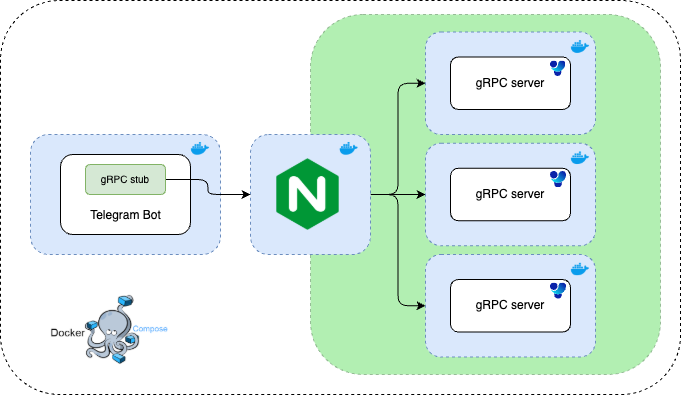
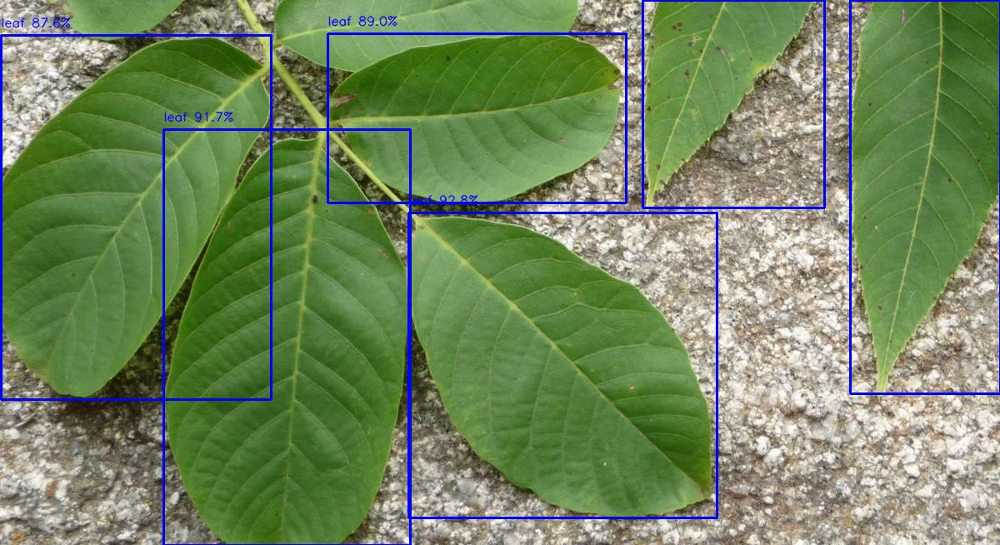

# About 

Telegram bot that allows you to identify diseases of a certain list of plants by a photo of a leaf.

<p align="center">
    
</p>

# Architecture



# 🌿 Disease Detection Pipeline

When a user sends an image of a potentially diseased plant, the following process is initiated:

1. **Leaf Detection (YOLOv11):**  
   The system first applies a YOLO-based leaf detection model ([YOLO](https://docs.ultralytics.com/ru/models/yolo11/)) to identify plant leaves in the image.

   <p align="center">
       
   </p>

2. **Leaf Cropping:**  
   If at least one leaf is detected, each detected leaf is cropped from the image. A list of cropped leaf images is generated for further analysis.

3. **Load Balancing and Classification (gRPC + NGINX):**  
   The cropped leaf images are sent via **gRPC** to an **NGINX** load balancer, which distributes the processing load across multiple identical classification servers running in parallel. This ensures scalability and speeds up inference time.

4. **Disease Classification:**  
   Each cropped leaf image is processed by machine learning models trained for **multi-class classification** of diseases. The classification results for all leaves are aggregated and sent back to the client (i.e., the bot).

5. **Result Aggregation and Decision Making (Bot):**  
   The bot aggregates probabilities across all detected leaves. If the probability that the plant is **healthy** is high enough, the bot informs the user but still provides the **top 3 most probable diagnoses** as a precaution.

   If the plant is likely **diseased**, the bot explicitly informs the user and provides the top 3 most probable diseases. For each suggested disease, it includes:
   - 📖 Name of the disease
   - 📷 An example image of the disease for comparison
   - 🔗 A link to a detailed article explaining the disease


# Classes
## 🍅 Tomato

### [Bacterial spot](https://hort.extension.wisc.edu/articles/bacterial-spot-of-tomato/)
<p align="center">
    
</p>

---

### [Early blight](https://www.missouribotanicalgarden.org/gardens-gardening/your-garden/help-for-the-home-gardener/advice-tips-resources/insects-pests-and-problems/diseases/fungal-spots/early-blight-of-tomato)
<p align="center">
    
</p>

---

### [Late blight](https://vegpath.plantpath.wisc.edu/diseases/tomato-late-blight/)
<p align="center">
    
</p>

---

### [Leaf mold](https://extension.umn.edu/disease-management/tomato-leaf-mold)
<p align="center">
    
</p>

---

### [Septoria leaf spot](https://www.missouribotanicalgarden.org/gardens-gardening/your-garden/help-for-the-home-gardener/advice-tips-resources/insects-pests-and-problems/diseases/fungal-spots/septoria-leaf-spot-of-tomato)
<p align="center">
    
</p>

---

### [Two-spotted spider mite](https://entomology.ca.uky.edu/ef310)
<p align="center">
    
</p>

---

### [Target spot](https://www.vegetables.bayer.com/ca/en-ca/resources/agronomic-spotlights/target-spot-of-tomato.html)
<p align="center">
    
</p>

---

### [Yellow leaf curl virus](https://agriculture.vic.gov.au/biosecurity/plant-diseases/vegetable-diseases/tomato-yellow-leaf-curl-virus)
<p align="center">
    
</p>

---

### [Mosaic virus](https://en.wikipedia.org/wiki/Tomato_mosaic_virus)
<p align="center">
    
</p>

## 🥒 Cucumber

### [Anthracnose](https://www.gardeningknowhow.com/edible/vegetables/cucumber/anthracnose-control-in-cucumbers.htm)
<p align="center">
    
</p>

---

### [Bacterial Wilt](https://www.missouribotanicalgarden.org/gardens-gardening/your-garden/help-for-the-home-gardener/advice-tips-resources/insects-pests-and-problems/diseases/bacterial-spots/bacterial-wilt-of-cucumber)
<p align="center">
    
</p>

---

### [Downy Mildew](https://www.ontario.ca/page/downy-mildew-greenhouse-cucumber)
<p align="center">
    
</p>

---

### [Gummy Stem Blight](https://www.ontario.ca/page/gummy-stem-blight-greenhouse-cucumber#:~:text=Gummy%20stem%20blight%20is%20a,is%20also%20called%20mycosphaerella%20rot.)
<p align="center">
    
</p>


## 🍈 Melon

### [Anthracnose](https://plantwiseplusknowledgebank.org/doi/10.1079/pwkb.20157800697#:~:text=Anthracnose%20damage%20on%20melon%20fruits,sunken%20with%20a%20yellowish%20colour.)
<p align="center">
    
</p>

---

### [Downy Mildew](https://extension.umn.edu/disease-management/downy-mildew-cucurbits)
<p align="center">
    
</p>


## 🍉 Watermelon


### [Downy Mildew](https://www.vegetables.bayer.com/language-masters/en-us/resources/growing-tips-and-innovation-articles/agronomic-spotlights/watermelon-downy-mildew.html)
<p align="center">
    
</p>

---

### [Mosaic Virus](https://en.wikipedia.org/wiki/Watermelon_mosaic_virus)
<p align="center">
    
</p>

## 🍓 Strawberry


### [Calcium Deficiency](https://ucanr.edu/site/strawberry-disorders-identification-management/calcium-deficiency)
<p align="center">
    
</p>

---

### [Angular Leaf Spot](https://ohioline.osu.edu/factsheet/HYG-3212-11)
<p align="center">
    
</p>

---

### [Leaf Spot](https://hort.extension.wisc.edu/articles/common-leaf-spot-of-strawberry/)
<p align="center">
    
</p>

---

### [Powdery Mildew](https://blogs.cornell.edu/berrytool/strawberries/powdery-mildew/)
<p align="center">
    
</p>

## 🫑 Pepper


### [Bacterial Spot](https://extension.wvu.edu/lawn-gardening-pests/plant-disease/fruit-vegetable-diseases/bacterial-leaf-spot-of-pepper)
<p align="center">
    
</p>

---

### [Leaf Blight](https://www.pepperhub.in/what-is-leaf-blight/?srsltid=AfmBOoqZQQ5W2BkjVZgPebhF6cK_uZg9Mltvui2Ekc2yj6fQculZTH01)
<p align="center">
    
</p>

---

### [Yellow Mottle Virus](https://www.sciencedirect.com/science/article/abs/pii/S2452014422001881#:~:text=The%20piper%20yellow%20mottle%20virus,it%20causes%20the%20stunt%20disease.)
<p align="center">
    
</p>

# How to Use

1. **Download the models**  
    Download and unzip the archive from [Yandex Disk](https://disk.yandex.ru/d/6ip0_MoAuxq50w).

2. **Place the detection model**  
    Copy `leaf_detect.pt` into `bot/models/leaf_detect.pt`.

3. **Place the classification models**  
    Copy each file into `mlcore/models/` with the exact filename:
    - `cucumber_cls_model.pt` — Cucumber
    - `melons_cls_model.pt` — Melon
    - `pepper_cls_model.pt` — Pepper
    - `strawberrie_cls_model.pt` — Strawberry
    - `tomato_cls_model.pt` — Tomato
    - `watermelon_cls_model.pt` — Watermelon

4. **Prerequisites**  
    Ensure you have:
    - Docker Compose installed.
    - A valid Telegram Bot Token.

5. **Start the bot**  
    From the project root, run:
    ```bash
    BOT_TOKEN=<YOUR_TELEGRAM_BOT_TOKEN> docker-compose up -d
    ```